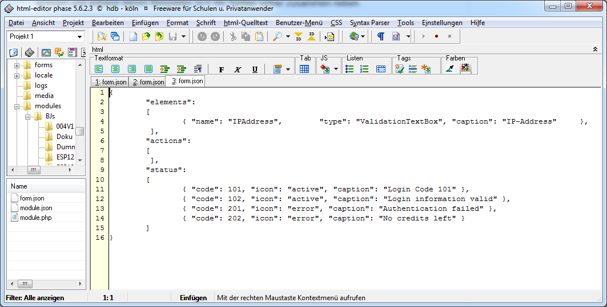

# Tutorialmodule für IPS

hier folgen nach und nach Beispielmodule,
am besten in der folgenden Reihenfolge durch arbeiten:

* String Receiver by NallChan
* zerlegeString

# Kurzhinweise zu GitHub und IPS

Die Githubs werden in IPS unter Kern-Instanzen --> Module

hinzugefügt und bei Bedarf auch upgedatet.

Leider ist die in der Liste dann links zu sehende Bezeichnung der

# Unterpfad eures GitHubs.

Also wählt ihn mit Bedacht und Aussagefähig genug,

denn nichts ist schlimmer als wenn 20-mal dort IPS erscheint.

Ich hab meine mal überarbeitet, sieht jetzt so aus:

   

# kurze Anleitung zum Erstellen eigener Module

Zum Editieren der Dateien benutze ich persönlich den folgenden Editor:

[html editor phase 5](http://www.phase5.info/)

Michael nutzt:

[NetBeans](https://netbeans.org/downloads/)

Vorteil: Der hat Git integriert und ein Plugin für Markdown (dieses README.md File) ist auch zu finden.


Unterhalb von Modules eigenes Unterverzeichnis erstellen.

Da rein gehört die Datei:

## library.json

   

aus einem anderen Modul rüber kopieren und alles anpassen:

wichtig: eine neue id generieren, z.B. mit:

[guidgenerator.com](https://www.guidgenerator.com/)

Kommentare sollten in einer .json Datei nicht mit den üblichen Slashes angelegt werden,
das nimmt einem das Modul sehr übel.

Falls das ganze später auf Github veröffentlicht werden sollte eine Datei

## README.md

anlegen und anhand dieses Beispieles sich die Syntax selber zusammen reiben.

Sollen dort auch Bilder mit erscheinen ein Unterverzeichnis mit dem Namen Doku erstellen und alle .png s dort hinein.

## Nun erstellen wir in diesem Unterverzeichnis das erste eigene Modulverzeichnis

Dort hinein gehören mindestens 3 Dateien:

## form.json

   

In dieser Datei wird der Aufbau der Seite des Modules erzeugt, sie teilt sich in 3 Bereiche und ist momentan sogar schon in der Doku zu finden:

Die nennen sich [Konfigurationsformulare](https://www.symcon.de/service/dokumentation/entwicklerbereich/sdk-tools/konfigurationsformulare/).

## module.json

   

Ähnlich der library.json. Same Procedure wie oben.

## module.php

hier tobt das eigentliche Modulleben

Randbemerkungen (Danke an Michael für die Infos):

PHP Module haben eine maximale Laufzeit von 30 Sekunden,

daher ist es nicht möglich einen Port für eingehende Informationen offen zu halten.

Alternativ sollte in solchen Fällen auf IPS hauseigenen Module zugegriffen werden indem man diese mit einbindet.

Doch aufgemerkt: die haben oft noch interne GUIDs welche an der richtigen Stelle positioniert werden muessen.

## Kleine PHP Schnipsel um das Arbeiten etwas zu erleichtern:

Wie finde ich die vorhandenen GUIDs:

```sh
<?php
foreach(IPS_GetModuleList() as $guid)
{
    $module = IPS_GetModule($guid);
    $pair[$module['ModuleName']] = $guid;
}
ksort($pair);
foreach($pair as $key=>$guid)
{
    echo $key." = ".$guid."\n";
}
?>
```
möchte man gerne wissen welche Parameter beispielsweise die serieelle Schnittstelle kennt:
```sh
<?php
print_r(IPS_GetConfiguration(ID des Serial Port));
?>
```
offenbart:

{"Open":false,"Port":"COM3","BaudRate":"115200","DataBits":"8","StopBits":"1","Parity":"None"}

oder ähnliches,

ab jetzt weiss man mit welchem Zauberwort der entsprechende Wert gesetzt werden kann und zwar per:
```sh
<?php
IPS_SetProperty(ID des Serial Port, 'StopBits', '1');
?>
```
auslesen einzelner Werte geht analog dazu:
```sh
<?php
IPS_GetProperty(ID des Serial Port, 'StopBits')
?>
```
wunderbar um Parameter zu checken.

In diesem Zusammenhang hilft uns auch die Doku weiter:

[IPS_SetProperty](https://www.symcon.de/service/dokumentation/befehlsreferenz/instanzenverwaltung/konfiguration/ips-setproperty/).