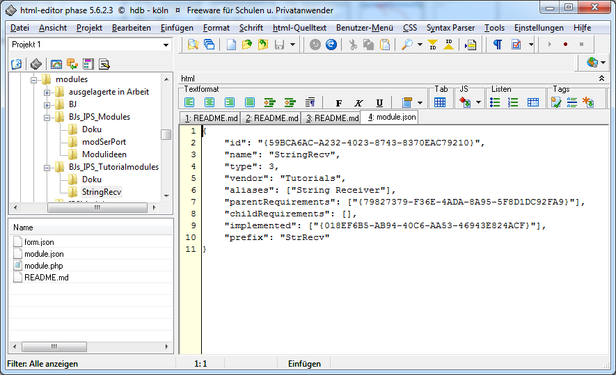

# Tutorialmodule für IPS

* String Receiver by Nall-chan

Das original Repro findet man
[HIER](https://github.com/Nall-chan/IPSTesting.git)

Als Ausgangsbasis diente ihm
[GitHub Nall.chan MS35](https://github.com/Nall-chan/IPSMS35).
Er reduzierte radikal, übrig blieb die Nutzung der Ein- und Ausgabefunktionen der hauseigenen IPS Module.

Beim Durchstöbern in seinem Original Code kam der gefühlte Eindruck auf ich befände mich nicht mehr unter lauter Bäumen auf der Suche nach dem Wald, Nee....., das war der Dschungel pur.

Diverse Versuche es auf die wichtigsten Funktionen zusammen zu streichen scheiterten bei mir, netterweise hat uns Michael dann diese Version überlassen.

Was fällt auf:

Dadurch, dass in der module.json 2 intern genutzte ID´s angesprochen werden, welche von mehreren Modulen genutzt werden, erscheint als übergeordnete Instanz alles, was diese ID´s nutzt.

Seht selbst:

   

Installieren des Modules (in der module.json steht als "vendor" Tutorials !)

   

wobei anzumerken ist dass dieses Modul selbst kein eigenes Interface erstellt, dazu kommen wir später.

Aus diesem Grunde bietet er im Pull-down als übergeordnete Instanz die bereits vorhandenen Schnittstellen an, welche kompatibel sind:

   

Möchten wir allerdings eine neue serielle Schnittstelle nutzen, so müssen wir sie selbst anlegen und verknüpfen.

