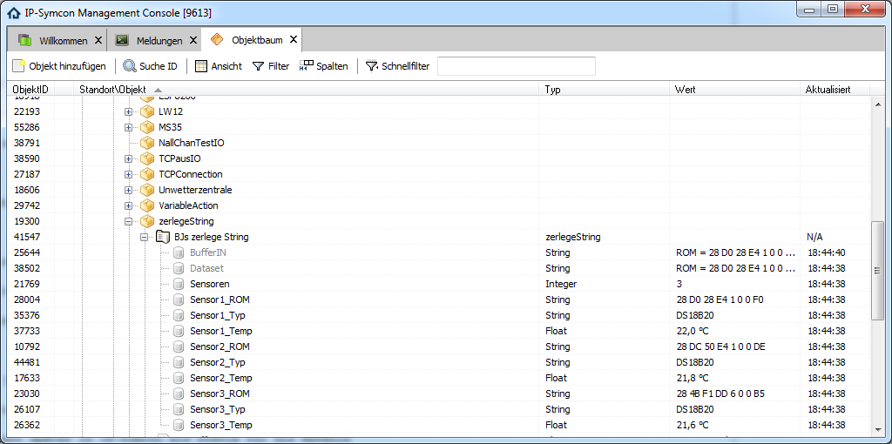

# Tutorialmodule für IPS

* zerlegeString

# was kann es?

anhand eines ESP-8266 Modules an welchem 3 Stück 1-Wire Temperatursensoren angeschlossen sind,
diese Daten einzelnen Variablen zuordnen.

Näheres zur Hardware im README des Modules StringRecv.

und so sieht es dann aus:

   

# wie gehen wir vor?

basierend auf dem Modul StringRecv basteln wir uns ein neues:

Vorgehensweise:

neues Modulverzeichnis anlegen

alle 4 Dateien des alten Modules in das neue kopieren:

form.json: kann so bleiben

module.json:

Zeile 2, neue id per [guidgenerator.com](https://www.guidgenerator.com/) erzeugen und hier tauschen.

Zeile 6, aussagekräftigen Namen einsetzen

Zeile 10 ersetzen, dient später in IP-Symcon als Prefix für die Befehle

Zeile 3 ist die wichtigste, der hier eingestellte Name definiert die neu zu schaffende Klasse welche später in IPS benutzt wird.

Man findet sie wieder in

module.php

in Zeile 3, dort muss sie entsprechend angepasst werden.

Unsere Ergänzungen halten Einzug ab Zeile 29.

Was ist zu tun?

* als erstes zusammenfassen der einzelnen Datenpakete zu einem gesamten.

* separieren des Gesamtpaketes: Startsequenz "CR/LF/CR/LF", Endekennung "No more adresses."

* daraus separieren der einzelnen für uns interessanten Daten:
* One-Wire Hardware ID: Startsequenz " ROM  = ", Endekennung "CR/LF"
* One-Wire Chip: Startsequenz " Chip  = ", Endekennung "CR/LF"
* Temperatur: Startsequenz " Temperature  = ", Endekennung " Celsius,"

* folgt jetzt eine weitere HardwareID das obige Schema wiederholen.

Alle Daten in ein Array und daraus dann Variablen füttern mit zusammenfassendem Dummymodul für jeden Temperatursensor.
Jedem Sensor ein zusätzliches Namensfeld, evtl. zusätzlich Standortsfeld verpassen, welches ausgefüllt werden muss.

Das mit dem Dummymodul hab ich aufgegeben, er findet die Dinger in den Childs nicht.

Ebenso sind for Schleifen nicht machbar, da wir uns hier in der Welt der objekt orieentierten Programmierung befinden sollte man vermutlich auf Funktionen zurück greifen.

Um das ganze schnell zum Abschluss zu bringen hab ich eine Copy&Paste Orgie betrieben und alles manuell angepasst,

es läuft bisher absturzfrei.

Das bisherige Beispiel ist auf 3 Sensoren ausgelegt, bei Bedarf einfach erweitern.